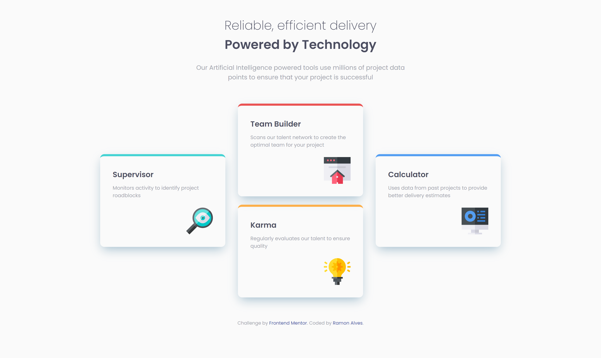

# Frontend Mentor - Four card feature section solution

This is a solution to the [Four card feature section challenge on Frontend Mentor](https://www.frontendmentor.io/challenges/four-card-feature-section-weK1eFYK). Frontend Mentor challenges help you improve your coding skills by building realistic projects. 

## Overview

### The challenge 🏆

Users should be able to:

- View the optimal layout for the site depending on their device's screen size

## Screenshots 🎴

- ### Desktop Preview

- ### Hover Effects

- ### Responsivity

### Links 💻

- Solution URL: [Frontend Mentor - Solution Page](https://www.frontendmentor.io/solutions/-html5-e-css-13-newbie-four-card-feature-section-z6bXbz49WW)
- Live Site URL: [Live Site](https://ramon-alvez.github.io/Frontend-Mentor-HTML-CSS-Newbie-Four-card-feature-section/)

## My process ✒

### Built with 🧱🛠

- Semantic HTML5 markup
- CSS custom properties
- Flexbox

### Continued development 🚀

My current goal is to finish all the FrontEnd Mentor challenges, to train and learn in the process. After finishing all HTML and CSS challenges, I will start JavaScript lessons.

## Author 🧙‍♂️

- GitHub - [Ramon Alvez](https://github.com/Ramon-Alvez)
- Frontend Mentor - [@Ramon Alvez](https://www.frontendmentor.io/profile/Ramon-Alvez)
- LinkedIn - [@Ramon Alvez](https://www.linkedin.com/in/ramon-alvez/)
